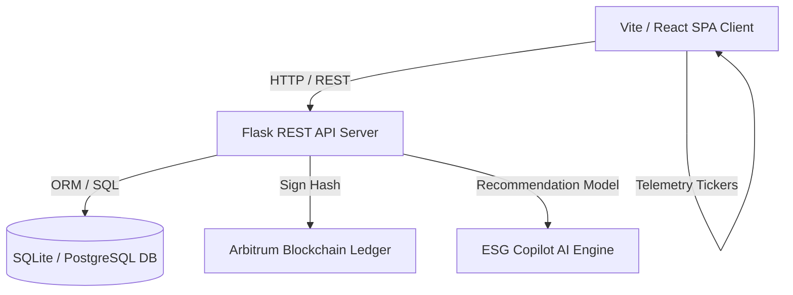

# EcoSphere AI: Intelligent ESG & Sustainability Management Platform

[](#)
[](#)
[](#)
[](#)
[](#)

EcoSphere AI is a production-ready, full-stack Enterprise SaaS ESG (Environmental, Social, and Governance) platform. It provides corporate sustainability teams with real-time carbon tracking, interactive ESG compliance risk models, on-chain blockchain transaction sealing, AI-generated advisory recommendations, gamified CSR engagement tools, and investor-ready reporting capabilities.

---

## 📖 Table of Contents
1. [Platform Architecture](#-platform-architecture)
2. [Key Capabilities](#-key-capabilities)
3. [Enterprise Demo & Simulation Suite](#-enterprise-demo--simulation-suite)
4. [Technology Stack](#-technology-stack)
5. [Directory Layout](#-directory-layout)
6. [Local Environment Setup](#-local-environment-setup)
7. [Environment Variables](#-environment-variables)
8. [API Endpoints Directory](#-api-endpoints-directory)
9. [Deployment Strategies](#-deployment-strategies)

---

## 🏗️ Platform Architecture

EcoSphere AI employs a decoupled, client-server architecture built for low latency and high auditability:



- **Client**: A single-page React 19 application built with Vite and Tailwind, rendering dynamic visualizations (Recharts), reactive layout state providers, and standard telemetry banners.
- **Server**: A Flask application exposing modular blueprints for modular authentication, transaction logging, and parameter configuration.
- **Database**: Defaults to a SQLite instance for zero-config local prototyping, with support for PyMySQL or PostgreSQL.
- **Blockchain Trust Layer**: Models cryptographically sealed ledger transactions with verification hashes.
- **AI Triage Layer**: Analyzes anomalies in electricity draw, logistics fuel rates, and waste metrics to provide action recommendations.

---

## 🌟 Key Capabilities

### 🍃 Environmental Ledger
- **Carbon Accounting**: Tracks carbon activity logs categorizing emissions (Electricity, Fuel, Waste, Transport) in compliance with Scope 1, 2, and 3 Greenhouse Gas Protocol rules.
- **Dynamic Calculator**: Inputs quantities and locations to calculate metric tCO₂e outputs using localized emission coefficient factors.
- **Target Milestones**: Tracks organization goal metrics (e.g., "Net Zero Carbon by 2030") with progress tracking.

### 👥 Social Responsibility (CSR)
- **Volunteering Tracker**: Logs community service contributions and department engagement rates.
- **Engagement Gamification**: Motivates team-level contributions through a points store, achievement badges, and eco-challenge checklists.

### ⚖️ Governance & Compliance
- **Regulatory Oversight**: Manages audit compliance lists (ISO 14001, ISO 26000), tracks executive reviews, and documents policy checklists.
- **Immutable Trust Center**: Publishes proof-of-sustainability ledger hashes, complete with cryptographic seals and multi-signature histories.

---

## 🎮 Enterprise Demo & Simulation Suite

To showcase the platform's reactive telemetry features without making database writes, the application includes a **Frontend Demo Mode & Presentation Engine**:

### 1. Live Telemetry Stream
- **Telemetry Sync Banner**: Sticky status bar displaying sensor tickers (last sync timer, online sensor count, logs processed today, AI recommended actions).
- **Speed Controller**: Adjust simulation tick loops to **Slow** (8s), **Normal** (5s), or **Fast** (2s) intervals.
- **Non-Interruptive Safe Boundaries**: Timers automatically skip execution whenever settings, forms, calculator fields, or login panels are active to prevent overriding user input.

### 2. Double-Mode Event Generator
- **Scenario Mode (Predefined Script)**: Loops a structured corporate ESG lifecycle:
  `Manufacturing energy spike ➔ AI recovery advisory ➔ Renewables solar connection ➔ Carbon index reduction ➔ ESG overall grade upgrade ➔ Auditor checklist approved ➔ Blockchain block verification sealed`.
- **Random Mode**: Procedurally generates randomized events (CSR volunteering contribution, compliance check completion, AI recommendation rotations, twin parameter drift).

### 3. Guided Presentation Show Mode
- **Split-Layout Console**: Shifts the main application content to the right by `410px` on desktop viewports, positioning the walkthrough panel statically inside the left gutter. This guarantees that tooltip controls and the app's components are completely visible next to each other.
- **Dimmed Click-Through Panels**: Viewport areas outside the highlighted element are darkened, while the target element remains completely interactive for manual typing or click events.
- **Active Navigation Routing**: Automatically updates paths, transitions views, and center-scrolls elements into focus as steps progress.
- **Persistence**: Walkthrough steps and simulation parameters are serialized in `localStorage` across page reloads.

---

## 💻 Technology Stack

### Backend
- **Core Framework**: Flask (Python 3.11+)
- **ORM / Database**: SQLAlchemy, Flask-SQLAlchemy, SQLite
- **Security**: Flask-JWT-Extended (JSON Web Tokens), CORS Middleware
- **Migration Engine**: Flask-Migrate

### Frontend
- **Runtime Client**: React 19 (TypeScript / JavaScript ES6)
- **Compiler / bundler**: Vite & Rolldown
- **Router**: React Router v6
- **Data Visualization**: Recharts
- **Iconography**: Lucide React
- **Styling Overrides**: Vanilla CSS backdrop blurs, transition transforms, glassmorphic dark-modes, and float keyframes

---

## 📂 Directory Layout

```text
EcoSphere/
├── backend/
│   ├── app/
│   │   ├── api/
│   │   │   └── routes/          # Blueprint endpoints (auth, environment, social, settings)
│   │   ├── models/              # Declarative database schemas
│   │   └── services/            # Business logic (carbon coefficients, blockchain)
│   ├── run.py                   # Application entry point & SQLite setup
│   └── requirements.txt         # Pip dependency manifest
└── frontend/
    ├── public/                  # Static assets & graphics
    ├── src/
    │   ├── components/
    │   │   ├── common/          # Cards, Badges, Avatar, Walkthrough elements
    │   │   └── layout/          # MainLayout, Sidebar, Navbar, Footer
    │   ├── context/             # Global Providers (Auth, ESG simulation, Themes)
    │   ├── pages/               # Feature submodules (Dashboard, Trust Center, Settings)
    │   ├── services/            # Axios API wrappers
    │   ├── index.css            # Styling tokens & glassmorphic overrides
    │   └── main.jsx             # React DOM bootstrapper
    ├── package.json             # NPM package scripts
    └── vite.config.js           # Vite server configuration
```

---

## 🚀 Local Environment Setup

### Prerequisites
- Python 3.11 or higher installed on your system.
- Node.js (v18.x or higher) and npm installed.

### 1. Initialize and Run the Backend API

1. Navigate to the backend directory:
   ```bash
   cd backend
   ```

2. Create a virtual environment and activate it:
   - **Windows (PowerShell)**:
     ```powershell
     python -m venv venv
     .\venv\Scripts\Activate.ps1
     ```
   - **Linux / macOS**:
     ```bash
     python3 -m venv venv
     source venv/bin/activate
     ```

3. Install dependencies:
   ```bash
   pip install -r requirements.txt
   ```

4. Launch the development server:
   ```bash
   python run.py
   ```
   *The backend will boot on [http://127.0.0.1:5000](http://127.0.0.1:5000) and automatically create a `dev.db` SQLite database.*

---

### 2. Initialize and Run the Frontend Client

1. Open a new terminal window and navigate to the frontend folder:
   ```bash
   cd frontend
   ```

2. Install dependencies:
   ```bash
   npm install
   ```

3. Launch the Vite client:
   ```bash
   npm run dev
   ```
   *The frontend client will host locally on [http://localhost:5173/](http://localhost:5173/).*

---

## ⚙️ Environment Variables

The backend loads configuration variables automatically. You can declare these in a `.env` file under the `/backend` directory:

| Variable | Description | Default Fallback Value |
| :--- | :--- | :--- |
| `SECRET_KEY` | Flask app cryptographic hashing secret | `dev-secret-key-change-in-prod` |
| `JWT_SECRET_KEY` | Token authentication signature | `jwt-secret-key-change-in-prod` |
| `DATABASE_URL` | SQLAlchemy connection string | `sqlite:///dev.db` |
| `CORS_ORIGINS` | Permitted cross-origin endpoints | `http://localhost:5173,http://127.0.0.1:5173` |

---

## 🔌 API Endpoints Directory

All API requests are prefixed with `/api`.

| Verb | Path | Auth Required | Description |
| :--- | :--- | :--- | :--- |
| **POST** | `/api/auth/register` | No | Creates a new user profile |
| **POST** | `/api/auth/login` | No | Authorizes user, returns a JSON Web Token |
| **GET** | `/api/auth/me` | Yes | Retrieves profile attributes of authenticated user |
| **GET** | `/api/environment/dashboard` | Yes | Gathers carbon summaries and AI recommendations |
| **GET** | `/api/environment/carbon` | Yes | Lists all recorded carbon emissions |
| **POST** | `/api/environment/carbon/calculate` | Yes | Inputs telemetry data and outputs calculated tCO₂e |
| **GET** | `/api/environment/emission-factors` | Yes | Lists active carbon conversion coefficients |
| **GET** | `/api/environment/goals` | Yes | Lists target sustainability goals |

---

## 🚢 Deployment Strategies

### Backend Deployment (e.g., Render, Heroku)
The Flask backend runs via a production-grade WSGI server like `gunicorn`.

1. Declare a `Procfile` at the root of the backend folder:
   ```text
   web: gunicorn run:app
   ```
2. Link the repository to Heroku/Render, configure production environment variables (`DATABASE_URL` pointing to PostgreSQL), and deploy.

### Frontend Deployment (e.g., Vercel, Netlify)
Vite generates optimized static assets ready to be served from CDNs.

1. Build the assets folder:
   ```bash
   npm run build
   ```
2. Deploy the resulting `/dist` folder to Vercel, Netlify, or AWS S3. Ensure fallback routes point to `index.html` to support React client-side routing.
